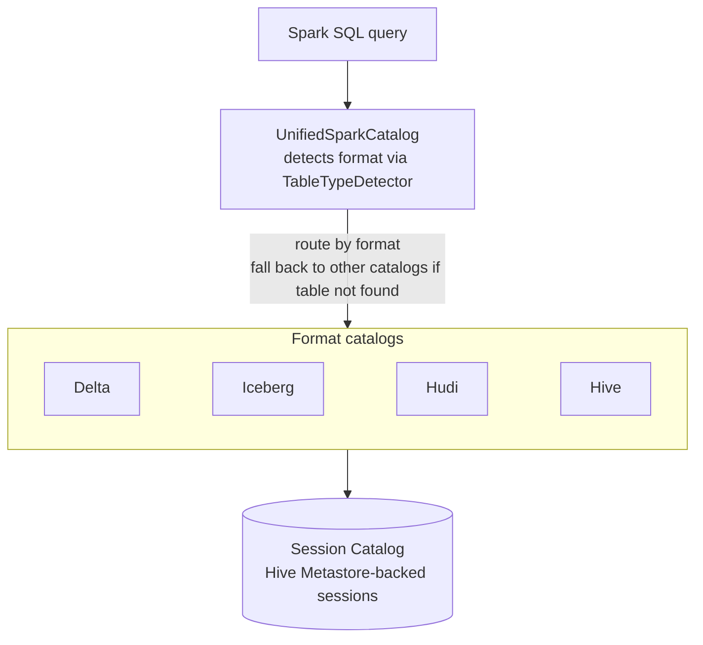

# Spark Unified Catalog

A Spark session catalog for **Hive Metastore-backed sessions** that routes table
operations to Delta Lake, Apache Iceberg, or Apache Hudi automatically, so
queries work across mixed formats without format-specific catalog prefixes.

`UnifiedSparkCatalog` wraps the session catalog, detects each table's format
from its metadata, and delegates to the matching format catalog. The approach is
inspired by Trino's table redirection.

## The problem it solves

A standard Spark session binds each table format to its own catalog, so queries
must carry format-specific catalog prefixes — and cross-format joins span
catalogs, which is awkward and easy to get wrong.

**Before** — separate catalog per format, prefixes everywhere:

```sql
-- spark.sql.catalog.iceberg_cat = org.apache.iceberg.spark.SparkCatalog
-- spark.sql.catalog.delta_cat   = ...
SELECT *
FROM   delta_cat.db.orders   o          -- Delta lives here
JOIN   iceberg_cat.db.users  u          -- Iceberg lives there
  ON   o.user_id = u.id;
```

**After** — one catalog, no prefixes, formats resolved automatically:

```sql
SELECT *
FROM   orders o                         -- Delta
JOIN   users  u                         -- Iceberg
  ON   o.user_id = u.id;
```

`UnifiedSparkCatalog` detects each table's format from its metadata and routes
to the right format catalog, so the same unqualified names work regardless of
whether a table is Delta, Iceberg, Hudi, or Hive.

## Features

- **Delta Lake, Iceberg, Hudi, and Hive** tables through one catalog.
- **Automatic format detection** from table metadata, with path-based inference
  and fallback across catalogs.
- **Lazy catalog initialization** and reuse of existing catalogs.
- **Spark 3.4 and 3.5** support; OpenLineage compatible.

## How it works

1. Load table metadata from the session catalog.
2. Identify the format with `TableTypeDetector`.
3. Route the operation to the Delta, Iceberg, or Hudi catalog.
4. If the table isn't found in the primary catalog, fall back to the others.



## Requirements

- Java 17+
- Apache Spark 3.4 or 3.5
- Maven 3.6+

## Build

```bash
git clone https://github.com/grab/unified-spark-catalog.git
cd unified-spark-catalog

mvn clean package              # Spark 3.5 (default)
mvn clean package -Pspark-3.4  # Spark 3.4
```

## Dependency

The artifactId carries the Spark version (Spark ecosystem convention):

```xml
<dependency>
  <groupId>com.grab</groupId>
  <artifactId>unified-spark-catalog-3.5_2.12</artifactId>  <!-- or unified-spark-catalog-3.4_2.12 -->
  <version>0.1.0</version>
</dependency>
```

## Getting started

**Prerequisite:** the format JARs you intend to query must be on the classpath.
`UnifiedSparkCatalog` initializes each format's catalog only when its JAR is
available — querying Delta tables requires the Delta JAR, Iceberg tables require
the Iceberg JAR, and Hudi tables require the Hudi JAR.

### 1. Configure the session

```scala
val spark = SparkSession.builder()
  .config("spark.sql.catalog.spark_catalog", "com.grab.UnifiedSparkCatalog")
  .config("spark.sql.extensions",
    "io.delta.sql.DeltaSparkSessionExtension," +
    "org.apache.iceberg.spark.extensions.IcebergSparkSessionExtensions")
  .getOrCreate()
```

### 2. Create tables in any format

```sql
CREATE TABLE delta_table   (id INT, name STRING) USING DELTA   LOCATION 's3://bucket/delta-table';
CREATE TABLE iceberg_table (id INT, name STRING) USING ICEBERG LOCATION 's3://bucket/iceberg-table';
```

### 3. Query across formats without a prefix

```sql
SELECT * FROM delta_table JOIN iceberg_table USING (id);
```

The Delta, Iceberg, and Hudi catalogs activate automatically when their JARs are
on the classpath; no enable flags are needed.

## Test

```bash
mvn test                          # Spark 3.5
mvn test -Pspark-3.4              # Spark 3.4
mvn test -Dtest=UnifiedSparkCatalogTest
```

## Compatibility

| Spark | Status |
|-------|--------|
| 3.4.x | Supported |
| 3.5.x | Supported (default) |
